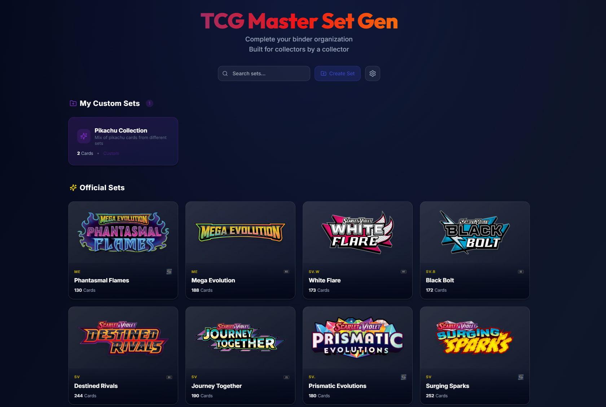
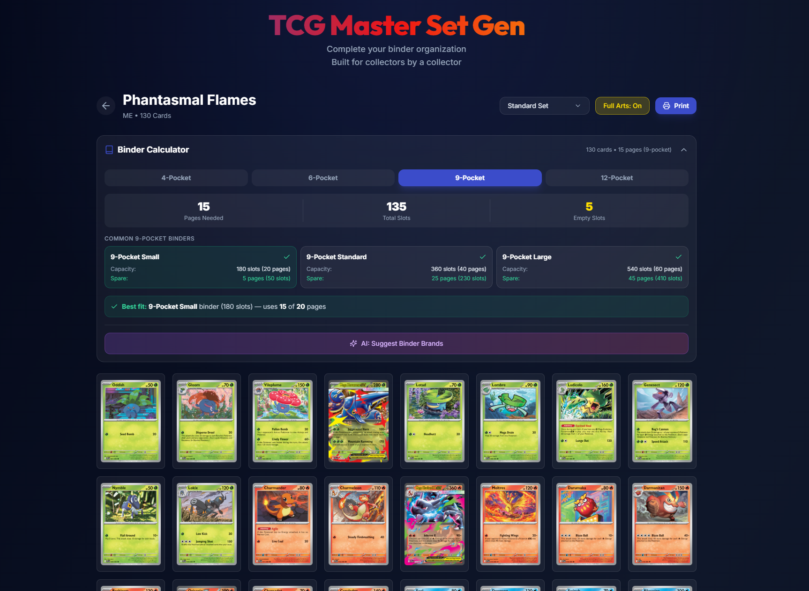
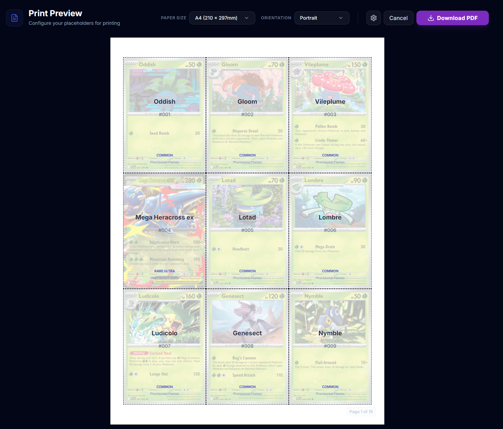

# TCG Master Set Gen 🎴

> Complete your binder organization with AI-powered placeholder generation.

[](https://warrendeveyra.github.io/TcgPlaceholderGen/)

A web app for Pokémon TCG collectors to generate placeholder cards for missing cards in their binder. Built for collectors, by a collector.



### Screenshots

| Landing Page | Set View | Print Preview |
|:---:|:---:|:---:|
|  |  |  |

## ✨ Features

- 📚 **Browse Official Sets** — Access all Pokémon TCG sets via the official API
- 🎨 **Custom Sets** — Create and manage your own custom card collections
- 🤖 **AI-Powered Generation** — Generate placeholder images using Google Gemini AI
- 📱 **PWA Support** — Install as an app on mobile or desktop
- 🖨️ **Print Ready** — Export placeholders for printing
- 🌙 **Dark Mode** — Premium dark UI designed for long sessions

## 🚀 Live Demo

**[https://warrendeveyra.github.io/TcgPlaceholderGen/](https://warrendeveyra.github.io/TcgPlaceholderGen/)**

## 🛠️ Tech Stack

- **React 18** + TypeScript
- **Vite** — Lightning fast builds
- **Tailwind CSS** — Utility-first styling
- **Framer Motion** — Smooth animations
- **Pokémon TCG API** — Card data
- **Google Gemini AI** — Placeholder generation

## 📦 Installation

```bash
# Clone the repo
git clone https://github.com/warrendeveyra/TcgPlaceholderGen.git
cd TcgPlaceholderGen

# Install dependencies
npm install

# Start dev server
npm run dev
```

## ⚙️ Configuration

### Gemini API Key

To use AI-powered placeholder generation:

1. Get a free API key from [Google AI Studio](https://aistudio.google.com/)
2. Open the app and click the ⚙️ Settings icon
3. Paste your API key and save

Your key is stored locally in your browser — never sent to any server.

## 🚀 Deployment

Deploy to GitHub Pages:

```bash
npm run deploy
```

## 🗺️ Roadmap

Planned features for future releases:

| TCG | Languages | Status |
| :--- | :--- | :--- |
| **Pokémon TCG** | 🇯🇵 Japanese | 🏗️ Ongoing |
| **Pokémon TCG** | 🇰🇷 Korean | 🔜 Planned |
| **Pokémon TCG** | 🇨🇳 Chinese | 🔜 Planned |
| **Yu-Gi-Oh! TCG** | 🇺🇸 English / 🇯🇵 Japanese | 🔜 Planned |
| **One Piece TCG** | 🇺🇸 English / 🇯🇵 Japanese | 🔜 Planned |

Have a feature request? [Open an issue](https://github.com/warrendeveyra/TcgPlaceholderGen/issues)!

## 📬 Contact

- **LinkedIn:** [Warren D.](https://linkedin.com/in/warren-d-552224195)
- **Facebook:** [Ren Dev](https://web.facebook.com/ren.dev12/)
- **Support:** [Buy me a coffee ☕](https://buymeacoffee.com/rendeveyra)

## 📄 License

MIT © [Ren](https://github.com/warrendeveyra)

---

<p align="center">
  Built with ❤️ for the Pokémon TCG community
</p>
